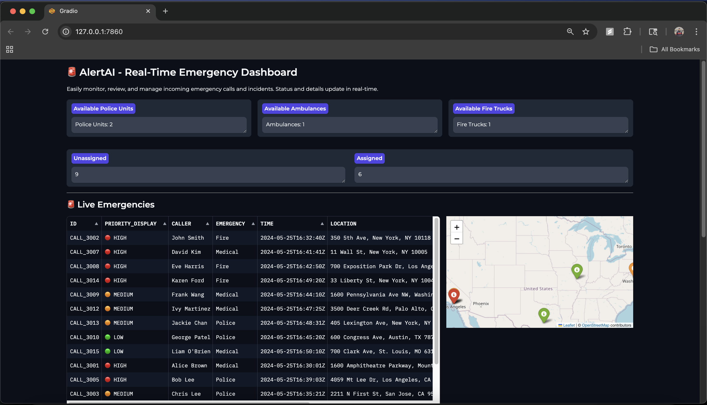
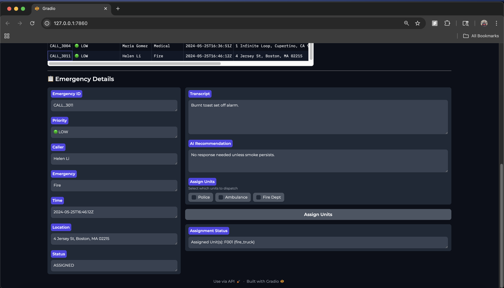

# 🚨 AlertAI

**AlertAI** is a real-time emergency response management platform that integrates automated call transcription, AI-powered recommendations, and live resource assignment for 911 centers and emergency responders.

It consists of two main parts:

- **Backend:** A FastAPI application for handling Twilio webhooks, audio streaming, transcriptions, and data management.
- **Frontend:** A Gradio-based dashboard for dispatchers to monitor, assign, and manage emergency resources in real-time.

---

## 📦 Features

- **Voice Call Handling:** Receives emergency calls via Twilio, streams audio, and transcribes speech.
- **Real-Time Dashboard:** Live view of all emergencies, caller details, locations (on a map), and resource assignments.
- **Resource Assignment:** Dispatch police, ambulances, or fire trucks directly from the dashboard.
- **AI Recommendations:** Suggests the best actions for each emergency using AI.
- **Map Integration:** Visualizes incidents on an interactive map.
- **Multi-user Support:** Designed for 911 centers and dispatch operations.

---

## 📷 Screenshots

### 📊 Dashboard Overview


### 📋 Emergency Details & Unit Assignment


---
---

## ⚡ Setup Instructions

### 1. **Clone the repository**

```bash
git clone https://github.com/Pranav-Vishwanatham/AlertAI.git
cd AlertAI
```

### 2. **Backend Setup**

```bash
cd backend
python -m venv venv
# Activate the virtual environment:
# On Mac/Linux:
source venv/bin/activate
# On Windows:
venv\Scripts\activate

pip install -r requirements.txt
```

- **Set up environment variables:**\
  Create a `.env` file in the `backend` directory and add necessary credentials (MongoDB URI, Twilio secrets, etc.).

### 3. **Frontend Setup**

```bash
cd ../frontend
pip install gradio
```

---

## ▶️ Running the Application

### 1. **Start Backend**

```bash
cd backend
# Make sure your virtual environment is active!
uvicorn app.services.main:app --reload
# (or python main.py if you use a direct script entry point)
```

### 2. **Start Frontend**

In a new terminal:

```bash
cd frontend
python frontend.py
```

---

## 📋 Usage

- Open the Gradio dashboard link (displayed in the terminal) in your browser.
- Monitor live emergencies, review AI-generated recommendations, and assign units as needed.
- Incoming calls and events appear instantly; maps update in real-time.

---

## 🧩 Technologies Used

- **FastAPI** (backend REST API)
- **MongoDB** (database)
- **Twilio** (voice streaming)
- **OpenAI/Azure** (speech-to-text & AI)
- **Gradio** (interactive dashboard UI)
- **Folium/Leaflet** (maps)
- **Python** (all codebase)


